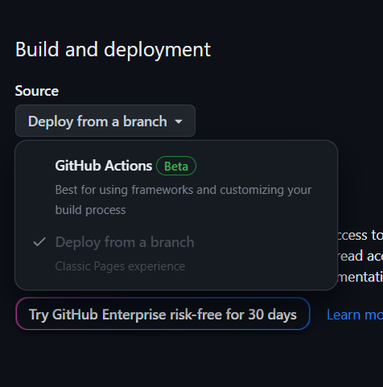
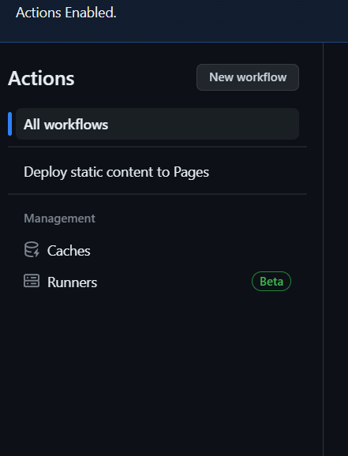
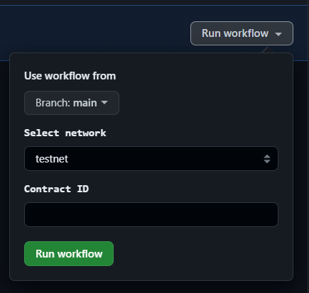
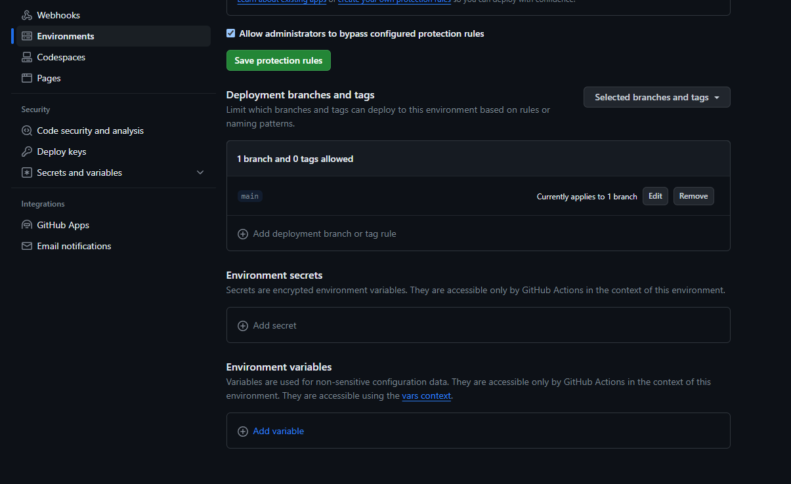

# Hedera Claiming page

## Getting Started

1. Install project dependencies using npm:

   ```bash
   npm install
   ```

2. Create a `.env` file in the root directory of the project with the following environment variables:

   ```env
   VITE_HEDERA_NETWORK=testnet
   VITE_HEDERA_SMART_CONTRACT_ID=0.0.12345

   VITE_WALLET_CONFIG_NAME=My app
   VITE_WALLET_CONFIG_DESCRIPTION=My app description
   VITE_WALLET_CONFIG_ICON_URL=https://myappicon.example/
   VITE_WALLET_CONFIG_APP_URL=https://walletconfginurl.example/
   ```

## Available Scripts


Start project in dev mode
   ```bash
   npm run dev
   ```

Build project
   ```bash
   npm run build
   ```

Serve static files after build
   ```bash
   npm run preview
   ```

Run linter
   ```bash
   npm run lint
   ```

## Deployment with github pages

1. Fork repo 
2. On your forked repo go to `Settings` > `Pages`
3. Select Github actions



4. Go to `Actions` and select `Deploy static content to pages`



5. Run workflow with yor details




Alternatively you can set you environment variables in repo setting. 



Variables set in that way take priority over values provided in `Run workflow` form.